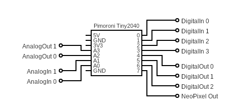

# neopixel-thing #

a simple thing for the "Modular-Things" project that allows you to control a WS2812 ("NeoPixel") RGB LED strip, 4 digital inputs, 3 digital outputs, 2 analog inputs, 2 analog outputs and the built-in RGB LED

> "NeoPixel" is the Adafruit name for products based on WS2812 RGB LEDs - in the context of this thing, both names may be used interchangeably


> Nota bene: in contrast to the "things" provided by the "Modular Things" project itself, this one has been developed for a [Pimoroni Tiny2040](https://shop.pimoroni.com/products/tiny-2040) board (which I had on my desk) and a [Waveshare RP2040-Zero](https://www.waveshare.com/wiki/RP2040-Zero) (which seems to be the cheapest of all small RP2040 boards). Since it uses the built-in RGB LEDs of that board, you may have to adjust the LED output commands in the Arduino "Firmware" shown below in order to make a thing for a different board.

> Strange: according to the [docs](https://files.waveshare.com/upload/5/58/RP2040-Zero.zip), the built-in WS2812 LED of a Waveshare RP2040-Zero should have a GRB byte order - however, I seem to have an official board (with logo and from a trusted seller) that uses an RGB order. My codes will still use the official GRB order, but some of the boards out there will thus show colors that differ from the expectation. However, this affects the built-in LED only, and everything else should work as expected. Which type of board you have can be easily recognized: just power it up (after uploading any "thing" firmware) and look at the LED: "normal" boards should glow green, others grow red.

## Wiring ##



> NeoPixel strings should usually be powered by a separate power supply!

## Installation and Usage ##

Below are instructions for installation and use of the "neopixel" thing - skip whatever does not seem applicable:

#### Firmware Preparation ####

1. Install Arduino IDE (see https://www.arduino.cc/en/software)
2. Install the board "**Raspberry Pi Pico/RP2040/RP2350** by Earle F. Philhower, III" using the Arduino "Boards Manager"
3. Install "**osap** by Jake Robert Read" using the Arduino "Library Manager"

#### Firmware Installation ####

1. Create a new sketch and rename it to `neopixel`
2. Copy the firmware shown below (or the contents of file [neopixel/firmware-RP2040-Zero/neopixel/neopixel.ino](neopixel/firmware-RP2040-Zero/neopixel/neopixel.ino) if you have a Waveshare RP2040-Zero board) into the sketch editor using the clipboard
3. Connect the RP2040 board via USB and select it from the board dropdown in the Arduino IDE
4. Compile and upload the sketch

#### Software Preparation ####

1. Install Node.js (see https://nodejs.org/en/)
2. Download "modular-things" as a [ZIP archive](https://github.com/modular-things/modular-things/archive/refs/heads/main.zip), unpack it, and move it to a location of your choice
3. Open a terminal window and navigate to the extracted directory
4. run `npm install`

#### Software Installation ####

1. Open the terminal window and navigate to the extracted directory
2. copy the "neopixel" directory from this repository and its contents into the `./things` folder. Delete the `firmware` folder for the wrong board and remove the board suffix from the name of the other (**you will not damage anything if you use the wrong firmware but the built-in LED will not work**). In the end, `./things/neopixel` should have the following structure:
```
./things/neopixel/
  circuit/
    images/
      layout.png
      schematic.png
      preview.png
  firmware/
    neopixel/
      neopixel.ino
  software/
    neopixel.ts
```
3. Insert the following text into file `./things/_things.json` after the first line (i.e., after the opening bracket):
```json
  {
    "author":  "Andreas Rozek",
    "name":    "neopixel",
    "software":"software/neopixel.ts",
    "firmware":"firmware/neopixel/neopixel.ino",
    "images": [
      { 
        "name": "layout", 
        "src": "circuit/images/layout.png"
      },
      { 
        "name": "schematic", 
        "src": "circuit/images/schematic.png"
      },
      { 
        "name": "preview", 
        "src": "circuit/images/preview.png"
      }
    ]
  },
```
4. Insert the following lines into file `./index.ts`
  * `import neopixel from "./neopixel/software/neopixel";`<br>
    e.g., as the last import statement
  * `neopixel,`<br>
    e.g., as the last line in the `export default {` block
5. (Re)start the server<br>
    `npm run dev`

#### Thing Usage ####

1. Connect the properly prepared RP2040 board to your computer via USB.
2. Open the (**custom**) web environment: [http://localhost:3000](http://localhost:3000)
3. Click on "pair new thing" and select the "thing" you connected before<br>(the "List of Things" should now display a description of its interface).
4. Click on "rename" and change the name of your thing to "NeoPixel" (this is the name used within the application example).
5. Copy the following example application into the web editor (and set the `NumOfPixels` to the actual length of your NeoPixel string):<br>
```javascript
const BlinkDelay  = 800 // LED toggles every BlinkDelay milliseconds

const NumOfPixels = 60
const PixelData = []
  for (let i = 0; i < NumOfPixels; i++) {
    let Hue        = i/NumOfPixels * 360
    let Saturation = 1
    let Value      = 0.1
    
    PixelData.push(...HSV2RGB(Hue,Saturation,Value))
  }
NeoPixel.setLength(NumOfPixels)
NeoPixel.loadPixels(PixelData)

let Timestamp = Date.now(), Value = 0
loop(async () => {
  let now = Date.now()
  if (Timestamp + BlinkDelay < now) {
    Value = (Value === 0 ? 0.1 : 0)
    await NeoPixel.setRGB(0,0,Value)

    Timestamp = now
  }
}, 10)


function HSV2RGB (Hue, Saturation, Value) {
  const Chroma = Value * Saturation
  const aux    = Chroma * (1 - Math.abs((Hue/60) % 2 - 1))
  const Match  = Value - Chroma

  let R,G,B
    if (Hue >= 0 && Hue < 60) {
      [R,G,B] = [Chroma,aux,0]
    } else if (Hue >= 60 && Hue < 120) {
      [R,G,B] = [aux,Chroma,0]
    } else if (Hue >= 120 && Hue < 180) {
      [R,G,B] = [0,Chroma,aux]
    } else if (Hue >= 180 && Hue < 240) {
      [R,G,B] = [0,aux,Chroma]
    } else if (Hue >= 240 && Hue < 300) {
      [R,G,B] = [aux,0,Chroma]
    } else {
      [R,G,B] = [Chroma,0,aux]
    }
  return [R+Match, G+Match, B+Match]
}
```
6. Click on "run (shift + enter)"<br>(the LED on the RP2040 board should blink now and the NeoPixel string show a color gradient).

## Firmware (Board-specific) ##

In the "Modular Things" terminology, the "firmware" of a thing is an Arduino sketch which implements a thing's functionality on the hardware side. Here is the one for a "neopixel" thing based on a Pimoroni Tiny2040 (please, use the contents of file [neopixel/firmware-RP2040-Zero/neopixel/neopixel.ino](neopixel/firmware-RP2040-Zero/neopixel/neopixel.ino) for a Waveshare RP2040-Zero board instead):

```c++
#include <osap.h>
#include <Adafruit_NeoPixel.h>

#define PIN_LED_R 18
#define PIN_LED_G 19
#define PIN_LED_B 20

  int DigitalIn[4]  = { 0,1,2,3 };
  int DigitalOut[3] = { 4,5,6 };
  int AnalogIn[2]   = { 26,27 };
  int AnalogOut[2]  = { 28,29 };

#define WS2812_PIN    7
#define WS2812_LENGTH 1024                    // max. number of addressable LEDs

  OSAP_Runtime osap;
  OSAP_Gateway_USBSerial serLink(&Serial);
  OSAP_Port_DeviceNames namePort("neopixel");

/**** RGB Control (RGB LED on Tiny2040 is "active low"!) ****/

  void _setRGB (uint8_t* Data, size_t Length) {
    analogWrite(PIN_LED_R, 65535-(Length < 2 ? 0 : Data[0] + Data[1]*255));
    analogWrite(PIN_LED_G, 65535-(Length < 4 ? 0 : Data[2] + Data[3]*255));
    analogWrite(PIN_LED_B, 65535-(Length < 6 ? 0 : Data[4] + Data[5]*255));
  }
  OSAP_Port_Named setRGB("setRGB",_setRGB);

/**** Digital Input ("active low" because of pull-up resistor) ****/

  size_t _getDigital (uint8_t* Data, size_t Length, uint8_t* Response) {
    if (Length > 0) {
      int Port = Data[0];
      if ((Port >= 0) && (Port <= 3)) {
        int Value = digitalRead(DigitalIn[Port]);
          Response[0] = (Value == LOW ? 1 : 0);                      // no typo!
        return 1;     // when connected to GND, _getDigital sends 1, otherwise 0
      }
    }
    return 0;
  }
  OSAP_Port_Named getDigital("getDigital",_getDigital);

/**** Digital Output ****/

  void _setDigital (uint8_t* Data, size_t Length) {
    if (Length > 0) {
      int Port = Data[0];
      if ((Port >= 0) && (Port <= 2)) {
        digitalWrite(DigitalOut[Port], (Length == 1) || (Data[1] == 0) ? LOW : HIGH);
      }
    }
  }
  OSAP_Port_Named setDigital("setDigital",_setDigital);

/**** Analog Input ****/

  size_t _getAnalog (uint8_t* Data, size_t Length, uint8_t* Response) {
    if (Length > 0) {
      int Port = Data[0];
      if ((Port >= 0) && (Port <= 1)) {
        uint16_t Value = analogRead(AnalogIn[Port]);
          Response[0] = Value & 0xFF;
          Response[1] = Value >> 8 & 0xFF;
        return 2;
      }
    }
    return 0;
  }
  OSAP_Port_Named getAnalog("getAnalog",_getAnalog);

/**** Analog Output ****/

  void _setAnalog (uint8_t* Data, size_t Length) {
    if (Length > 0) {
      int Port = Data[0];
      if ((Port >= 0) && (Port <= 1)) {
        analogWrite(AnalogOut[Port], (Length < 2 ? 0 : Data[1] + Data[2]*255));
      }
    }
  }
  OSAP_Port_Named setAnalog("setAnalog",_setAnalog);

/**** WS2812 Control ****/

  Adafruit_NeoPixel Strip(WS2812_LENGTH, WS2812_PIN, NEO_GRB + NEO_KHZ800);

  void _setLength (uint8_t* Data, size_t Length) {
    Strip.clear();
    Strip.show();

    if (Length > 1) {
      int Count = Data[0] + (Length < 2 ? 0 : Data[1])*255;
      if (Count > WS2812_LENGTH) { Count = WS2812_LENGTH; }

      Strip.updateLength(Length < 1 ? 0 : Data[0]);
    }
  }
  OSAP_Port_Named setLength("setLength",_setLength);


  void _clear (uint8_t* Data, size_t Length) {
    Strip.clear();
    Strip.show();
  }
  OSAP_Port_Named clear("clear",_clear);


  void _setPixel (uint8_t* Data, size_t Length) {
    if (Length > 2) {
      int Pixel = Data[0] + Data[1]*255;
        int R = (Length < 3 ? 0 : Data[2]);
        int G = (Length < 4 ? 0 : Data[3]);
        int B = (Length < 5 ? 0 : Data[4]);
      Strip.setPixelColor(Pixel,Strip.Color(R,G,B));
      Strip.show();
    }
  }
  OSAP_Port_Named setPixel("setPixel",_setPixel);


  void _loadPixels (uint8_t* Data, size_t Length) {
    Strip.clear();

    int Count = Length/3;
    for (int Pixel = 0; Pixel <= Count; Pixel++) {
      int Index = Pixel*3;
        int R = (Length < Index+1 ? 0 : Data[Index]);
        int G = (Length < Index+2 ? 0 : Data[Index+1]);
        int B = (Length < Index+3 ? 0 : Data[Index+2]);
      Strip.setPixelColor(Pixel,Strip.Color(R,G,B));
    }

    Strip.show();
  }
  OSAP_Port_Named loadPixels("loadPixels",_loadPixels);

/**** Startup ****/

  void setup() {
    osap.begin();

    analogWriteResolution(16);             // according to RP2040 specifications

    pinMode(PIN_LED_R,OUTPUT);
    pinMode(PIN_LED_G,OUTPUT);
    pinMode(PIN_LED_B,OUTPUT);

    analogWrite(PIN_LED_R,65535);              // initially switches the LED off
    analogWrite(PIN_LED_G,65535);                                        // dto.
    analogWrite(PIN_LED_B,65535);                                        // dto.

    for (int Port = 0; Port < 4; Port++) {
      pinMode (DigitalIn[Port],INPUT_PULLUP);    // for a well-defined potential
    }

    for (int Port = 0; Port < 3; Port++) {
      pinMode(DigitalOut[Port],OUTPUT);
    }

    for (int Port = 0; Port < 2; Port++) {
      analogRead(AnalogIn[Port]);

      pinMode(AnalogOut[Port],OUTPUT);
      analogWrite(AnalogOut[Port],0);
    }

    Strip.begin();
    Strip.clear();
    Strip.show();
  }

/**** Operation ****/

  void loop() {
    osap.loop();
  }
```

## Software ##

In the "Modular Things" terminology, the "software" of a thing is its JavaScript interface (which may still include some additional functionality on the software side). Here is the one for the "neopixel" thing:

```typescript
import Thing from "../../../src/lib/thing"

export default class neopixel extends Thing {
  async setRGB (R:number, G:number, B:number):Promise<void> {
    const LED_R = Math.floor(65535 * Math.max(0,Math.min(R,1)))
    const LED_G = Math.floor(65535 * Math.max(0,Math.min(G,1)))
    const LED_B = Math.floor(65535 * Math.max(0,Math.min(B,1)))

    const Datagram = new Uint8Array([
      LED_R & 0xFF, (LED_R >> 8) & 0xFF,
      LED_G & 0xFF, (LED_G >> 8) & 0xFF,
      LED_B & 0xFF, (LED_B >> 8) & 0xFF,
    ])
    await this.send('setRGB',Datagram)
  }

/**** WS2812 Control ****/

  async setLength (Length:number):Promise<void> {
    Length = Math.floor(Math.max(0,Math.min(Length,1024)))
    await this.send('setLength',new Uint8Array([
      Length & 0xFF, Length >> 8 & 0xFF
    ]))
  }

  async clear ():Promise<void> {
    await this.send('clear',new Uint8Array([]))
  }

  async setPixel (Pixel:number, R:number,G:number,B:number):Promise<void> {
    Pixel = Math.floor(Pixel)
    if ((Pixel < 0) || (Pixel >= 1024)) { return }
      R = Math.floor(Math.max(0,Math.min(R*255,255)))
      G = Math.floor(Math.max(0,Math.min(G*255,255)))
      B = Math.floor(Math.max(0,Math.min(B*255,255)))
    await this.send('setPixel',new Uint8Array([Pixel,R,G,B]))
  }

  async loadPixels (RGBList:number[]):Promise<void> {
    RGBList = RGBList.map(
      (Value:number) => Math.floor(Math.max(0,Math.min(Value*255,255)))
    )
    await this.send('loadPixels',new Uint8Array(RGBList))
  }

/**** API Specification ****/

  public api = [{
    name: 'setRGB',
    args: [
      'R: 0 to 1',
      'G: 0 to 1',
      'B: 0 to 1'
    ]
  },{
    name:  'getDigital',
    args:  [ 'port: 0 to 3' ],
    return:'true or false'
  },{
    name:  'setDigital',
    args:  [ 'port: 0 to 2', 'value: true or false' ]
  },{
    name:  'getAnalog',
    args:  [ 'port: 0 to 1' ],
    return:'0 to 1'
  },{
    name:  'setAnalog',
    args:  [ 'port: 0 to 1', 'value: 0 to 1' ]
  },{
    name: 'setLength',
    args: [ 'length: 0 to 1024' ]
  },{
    name: 'clear',
    args: []
  },{
    name: 'setPixel',
    args: [ 'pixel: 0 to 1023', 'r: 0 to 1', 'g: 0 to 1', 'b: 0 to 1' ]
  },{
    name: 'loadPixels',
    args: [ 'rgb-list: list of 0 to 1, three values per pixel' ]
  }]
}
```

## Application Example ##

An "application" may be some JavaScript code entered into and run by the "Modular Things" web editor.

> **Important**: as soon as you plan to use custom things, you can no longer use the original web environment found at [https://modular-things.com/](https://modular-things.com/) but must navigate your browser to [http://localhost:3000](http://localhost:3000) (assuming that you use the default port).

Here is an example for an application using the "neopixel" thing:

```javascript
const BlinkDelay  = 800 // LED toggles every BlinkDelay milliseconds

const NumOfPixels = 64
const PixelData = []
  for (let i = 0; i < NumOfPixels; i++) {
    let Hue        = i/NumOfPixels * 360
    let Saturation = 1
    let Value      = 0.1

    PixelData.push(...HSV2RGB(Hue,Saturation,Value))
  }
NeoPixel.setLength(NumOfPixels)
NeoPixel.loadPixels(PixelData)

let Timestamp = Date.now(), Value = 0
loop(async () => {
  let now = Date.now()
  if (Timestamp + BlinkDelay < now) {
    Value = (Value === 0 ? 0.1 : 0)
    await NeoPixel.setRGB(0,0,Value)

    Timestamp = now
  }
}, 10)


function HSV2RGB (Hue, Saturation, Value) {
  const Chroma = Value * Saturation
  const aux    = Chroma * (1 - Math.abs((Hue/60) % 2 - 1))
  const Match  = Value - Chroma

  let R,G,B
    if (Hue >= 0 && Hue < 60) {
      [R,G,B] = [Chroma,aux,0]
    } else if (Hue >= 60 && Hue < 120) {
      [R,G,B] = [aux,Chroma,0]
    } else if (Hue >= 120 && Hue < 180) {
      [R,G,B] = [0,Chroma,aux]
    } else if (Hue >= 180 && Hue < 240) {
      [R,G,B] = [0,aux,Chroma]
    } else if (Hue >= 240 && Hue < 300) {
      [R,G,B] = [aux,0,Chroma]
    } else {
      [R,G,B] = [Chroma,0,aux]
    }
  return [R+Match, G+Match, B+Match]
}
```


This application lets the built-in LED blink blue and the NeoPixel string show a color gradient.

## License ##

[MIT License](LICENSE.md)
